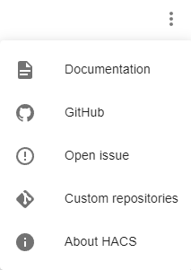
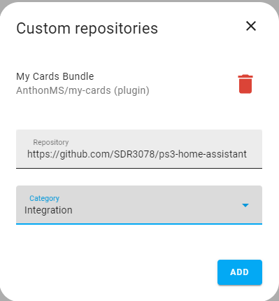
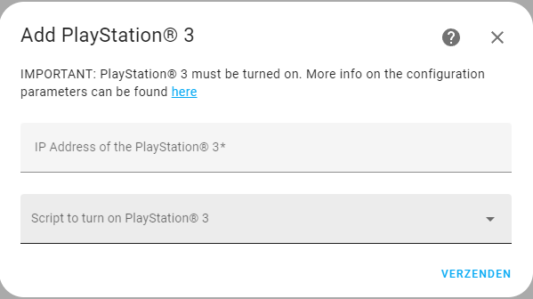

# PlayStation® 3 - Home Assistant

  <picture>
    <source srcset="resources/logo/dark_icon.png" media="(prefers-color-scheme: dark)">
    <source srcset="resources/logo/icon.png" media="(prefers-color-scheme: light)">
    
  </picture>

## Table of Contents

- [Introduction](#introduction)
- [Features](#features)
- [Installation](#installation)
- [Configuration](#configuration)
- [Configuration](#configuration)
- [License](#license)
- [Contact](#contact)

## Introduction

Welcome to the Home Assistant integration for the PlayStation® 3! This integration will allow you to control your PlayStation from within Home Assistant. It exposes multiple entities related to temperature control, gameplay and screen notifications.

> **⚠️ Note:**
>
> This integration will only work with PlayStation® 3 systems that run custom firmware like Evilnat or PS3HEN and have [webMAN MOD](https://github.com/aldostools/webMAN-MOD/releases/) installed.

## Features

### Media Control

The integration exposes a media player entity that allows you to:

- Turn on/off the system
- Monitor active game title, session duration and game icon
- Launch and stop games
- Mount different games

### Temperature Control

The integration exposes a climate entity that allows you to:
- Turn on/off the system
- Monitor CPU temp/RSX temp and overall system temp
- Choose the fan mode of the PS3 ([Dynamic](https://github.com/aldostools/webMAN-MOD/wiki/~-Fan-Settings#dynamic-auto) / [Auto](https://github.com/aldostools/webMAN-MOD/wiki/~-Fan-Settings#auto-2) / [Manual](https://github.com/aldostools/webMAN-MOD/wiki/~-Fan-Settings#manual) / [SYSCON](https://github.com/aldostools/webMAN-MOD/wiki/~-Fan-Settings#syscon))
  - In case you selected [Dynamic](https://github.com/aldostools/webMAN-MOD/wiki/~-Fan-Settings#dynamic-auto), you are also able to select the temperature for the system.

### Fan Control

The integration exposes a number entity that allows you to control the fan speed of the PS3 when in [manual](https://github.com/aldostools/webMAN-MOD/wiki/~-Fan-Settings#manual) fan mode. When changing the value while the system is not in manual fan mode, it will automatically change. Furthermore, it allows you to monitor the fan speed in other modes.

### Notify Service

The integration also exposes a Notify service to display messages on the tv screen. The notification icon and sound can be customized by including it as a dictionary in the service data according to [webMAN documentation](https://github.com/aldostools/webMAN-MOD/wiki/Web-Commands#notifications--system-info).

## Installation

### Prerequisites

Before you begin, ensure you have met the following requirements:

- You have to custom firmware like Evilnat installed or you have to run PS3HEN.
- You have to run the standard or full [version](https://github.com/aldostools/webMAN-MOD/wiki/~-Differences-Between-Editions) of webMAN MOD.

### Steps

#### HACS install
We are currently waiting for the integration to be approved as a default repository in the HACS store so the integration can be installed from the HACS UI. In the meantime you can install the integration as a custom repository in HACS.

1. Select 'Custom repositories' in the kebab menu in HACS in the upper right.

    

2. Enter the GitHub link in the 'repository' field and select 'Integration' in the 'Category' field.

    

3. Click 'Add' to confirm.

#### Manual install

1. Add the ps3 folder from [custom_components](https://github.com/SDR3078/ps3-home-assistant/tree/main/custom_components) to the 'custom_components' folder of your Home Assistant Install.

## Configuration
> **ℹ Info on turn-on script:**
>
> There are lots of different options to turn on PlayStation® 3 devices with custom firmware. Users with PEX or DEX systems can enable Wake-on-LAN to turn on their system. PlayStation® 3 Slim & Super Slim devices  connected to a TV that supports HDMI-CEC can also be turned on by changing the source on their TV.
>
> Therefore,, we decided to let the user themselves decide the logic to turn on their system using Home Assistant scripts. For systems supporting WoL, a script can be configured in the Home Assistant UI that fires a WoL message. For systems supporting HDMI-CEC, a script can be configured that turns on the TV and sets it to the proper source channel. If your system does not support any of these, you can always leave the according field empty during setup and the integration will configure Home Assistant so it does not display any buttons to turn on your PlayStation® 3.

1. Once installed, you can add your PlayStation® 3 by going to [Settings > Devices & services > Integrations](https://my.home-assistant.io/redirect/integrations) and click the blue button in the right lower corner to add a new integration.

2. Look for the PlayStation® 3 integration and add it to the list.

3. You should now be able to see the configuration screen. Here you can enter the IP address of your system. Your existing scripts will be listed in the dropdown menu where you can select a script that will turn on the system and will be fired when pushing the power button on the climate card or the media player card. The system should be turned on during configuration, otherwise it will return an error as it cannot establish a successful connection.

    

## License
[Apache License 2.0](https://github.com/SDR3078/ps3-home-assistant/blob/main/LICENSE.md)